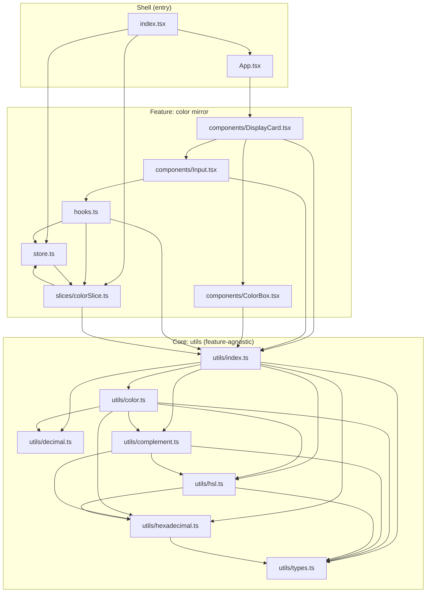

# Architecture Dependencies

A first-party module dependency map for Hex Mirror, produced by the code sweep as a decoupling aid. Nodes are the project's own modules; edges are import dependencies. Third-party imports (React, Redux Toolkit, styled-components) are omitted. Clusters mark the three layers: the imperative shell, the single user-facing feature (the color mirror), and the feature-agnostic color-math core.

## Module Graph

## Coupling Notes

- **Single core seam.** Every feature and shell module reaches the color math only through the `utils/index.ts` barrel, never into individual util files. Swapping or splitting a util touches one import site.
- **`store.ts` ↔ `slices/colorSlice.ts` type-only cycle.** `store.ts` imports the slice's reducer and `initialState`; the slice imports `RootState` back for its selector typing. The cycle is types-only and resolves at compile time — acceptable, but the seam to break if the slice is ever extracted is the `RootState` import.
- **No cross-feature edges.** With the former compare-analysis feature removed, the tree holds one user-facing feature. If a second feature is added, give it its own component/slice group and keep it importing only the `utils` core and its own files, so the delete-a-feature and subset-release tests continue to hold.
- **Core is a clean DAG.** `utils` has no import back into the feature or shell layers; `types.ts` and `decimal.ts` are leaves.
